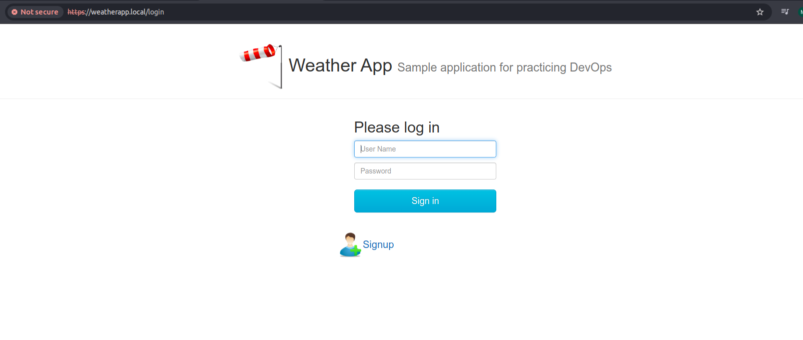
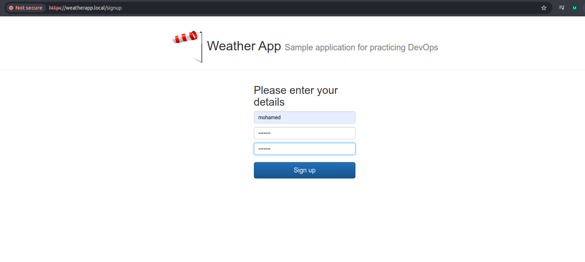

# 🌦️ My Weather App (Kubernetes Microservices)

A complete **microservices-based weather application** deployed on **Kubernetes (Minikube)** using:

* MySQL (StatefulSet)
* Auth Service (JWT-based authentication)
* Weather Service (OpenWeather API)
* UI Service (served via Ingress with TLS)

This project is designed as a **learning-focused but production-style setup**, covering:

* Secrets management
* Stateful workloads
* Init Jobs
* Ingress + TLS
* Service-to-service communication

---

## 🧠 Architecture Overview

```
                     ┌─────────────────────────┐
                     │      Browser / User     │
                     │  https://weatherapp.local│
                     └────────────┬────────────┘
                                  │
                           Ingress (nginx)
                                  │
                     ┌────────────┴────────────┐
                     │        UI Service        │
                     │   weatherapp-ui:3000    │
                     └───────┬─────────┬───────┘
                             │         │
               ┌─────────────▼───┐ ┌───▼─────────────┐
               │   Auth Service   │ │ Weather Service │
               │ weatherapp-auth │ │ weatherapp-weather│
               │      :8080      │ │       :5000      │
               └───────┬─────────┘ └─────────┬───────┘
                       │                     │
                ┌──────▼──────┐      ┌───────▼────────┐
                │    MySQL     │      │ OpenWeather API│
                │ StatefulSet  │      │ (External API) │
                └─────────────┘      └────────────────┘
```

---

## 📁 Project Structure

```
my-weather-app
├── auth-service
│   ├── deployment.yaml
│   ├── svc.yaml
│   └── mysql
│       ├── statefulset.yaml
│       ├── headless-svc.yaml
│       ├── init-job.yaml
│       └── secret.yaml
│
├── weather-service
│   ├── deployment.yaml
│   ├── svc.yaml
│   └── secret.yaml        # OpenWeather API Key
│
└── ui-service
    ├── deployment.yaml
    ├── svc.yaml
    ├── ingress.yaml
    ├── secret.yaml        # TLS Secret
    ├── tls.crt
    └── tls.key
```

---

## ⚙️ Prerequisites

### 1️⃣ Install Required Tools

* **Docker**

  * [https://docs.docker.com/get-docker/](https://docs.docker.com/get-docker/)

* **kubectl**

  * [https://kubernetes.io/docs/tasks/tools/](https://kubernetes.io/docs/tasks/tools/)

* **Minikube**

  * [https://minikube.sigs.k8s.io/docs/start/](https://minikube.sigs.k8s.io/docs/start/)

---

## 🚀 Start Minikube & Enable Ingress

```bash
minikube start
minikube addons enable ingress
```

Verify ingress controller:

```bash
kubectl get pods -n ingress-nginx
```

---

## 🔐 Secrets Setup

### 1️⃣ MySQL + JWT Secrets (Auth Service)

```bash
kubectl apply -f auth-service/mysql/secret.yaml
```

This secret contains:

* MySQL root password
* Auth DB user password
* JWT `SECRET_KEY`

---

### 2️⃣ OpenWeather API Key (Weather Service)

Create an API key from:
👉 [https://openweathermap.org/api](https://openweathermap.org/api)

Encode it:

```bash
echo -n "<OPENWEATHER_API_KEY>" | base64
```

Update `weather-service/secret.yaml`, then:

```bash
kubectl apply -f weather-service/secret.yaml
```

---

### 3️⃣ TLS for UI Service (Ingress)

Generate a self-signed certificate:

```bash
openssl req -x509 -nodes -days 365 -newkey rsa:2048 \
  -keyout tls.key -out tls.crt \
  -subj "/CN=weatherapp.local/O=weatherapp"
```

Create TLS Secret:

```bash
kubectl create secret tls weatherapp-ui-tls \
  --cert=tls.crt \
  --key=tls.key \
  --dry-run=client -o yaml > secret.yaml
```

Apply it:

```bash
kubectl apply -f ui-service/secret.yaml
```

---

## 📦 Deployment Order (IMPORTANT)

### 1️⃣ MySQL (Database Layer)

```bash
kubectl apply -f auth-service/mysql/headless-svc.yaml
kubectl apply -f auth-service/mysql/statefulset.yaml
```

Wait for MySQL Pod:

```bash
kubectl get pods -l app=mysql
```

Run DB Init Job:

```bash
kubectl apply -f auth-service/mysql/init-job.yaml
```

---

### 2️⃣ Auth Service

```bash
kubectl apply -f auth-service/deployment.yaml
kubectl apply -f auth-service/svc.yaml
```

---

### 3️⃣ Weather Service

```bash
kubectl apply -f weather-service/deployment.yaml
kubectl apply -f weather-service/svc.yaml
```

---

### 4️⃣ UI Service + Ingress

```bash
kubectl apply -f ui-service/deployment.yaml
kubectl apply -f ui-service/svc.yaml
kubectl apply -f ui-service/ingress.yaml
```

---

## 🌐 Domain Setup (Local)

Get Minikube IP:

```bash
minikube ip
```

Add to `/etc/hosts`:

```text
<MINIKUBE_IP> weatherapp.local
```

---

## 🧪 Testing

### From Browser

```
https://weatherapp.local
```

(Accept self-signed certificate warning)

### From CLI

```bash
curl -k https://weatherapp.local
```
## 📸 Screenshots

### 🏠 UI – Home Page


---

### 🌦️ Weather Data (Cairo Example)


---

### 🔐 Auth Service (Login / JWT)


---


## 🧹 Cleanup

```bash
kubectl delete ingress weatherapp-ui-ingress
kubectl delete deployments --all
kubectl delete svc --all
kubectl delete pvc --all
```
---

## Author

Mohamed Ahmed Mohamed Taha
